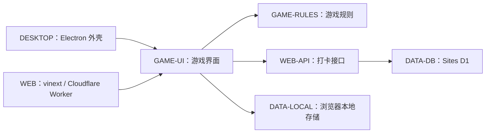
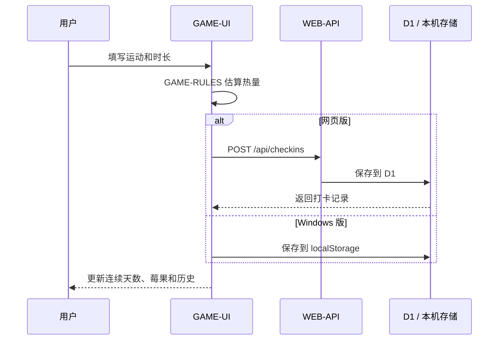

# 草莓打卡屋项目架构

> 文档基线：2026-08-08  
> 用途：记录当前真实架构，并作为后续问题批注与修改入口。  
> 原则：先在“待修改清单”写清问题，再按模块编号定位代码；代码修改完成后同步更新本文档。

## 1. 架构总览

项目共用一套 React 游戏界面，同时输出网页版和 Windows 桌面版。



## 2. 目录结构

```text
project_009_草莓打卡屋/
├─ app/
│  ├─ api/checkins/route.ts   # 网页版打卡 API
│  ├─ game/                   # 无界面的游戏规则
│  │  ├─ calories.ts          # 热量估算
│  │  ├─ cat-actions.ts       # 猫咪状态与动画序列
│  │  ├─ furniture.ts         # 家具落点与移动边界
│  │  ├─ pet-stats.ts         # 活力、困倦、睡眠规则
│  │  ├─ time-period.ts       # 早晨 / 白天 / 傍晚 / 夜晚
│  │  └─ weather.ts           # 天气映射与房间背景选择
│  ├─ globals.css             # 全部网页与游戏样式
│  ├─ layout.tsx              # 页面元信息与根布局
│  └─ page.tsx                # 游戏界面、交互和状态协调
├─ db/                        # D1 访问与表结构
├─ desktop/                   # 桌面版 React 构建入口
├─ electron/                  # Windows 窗口、更新和安全桥接
├─ drizzle/                   # 数据库迁移记录
├─ public/game/               # 房间、猫咪、家具等游戏素材
├─ tests/                     # 构建后回归检查
├─ worker/                    # Cloudflare Worker 入口
├─ docs/                      # 架构与设计文档
├─ .openai/hosting.json       # Sites 资源声明
├─ package.json               # 命令、依赖和桌面打包配置
└─ vite.config.ts             # 网页版构建配置
```

构建产物位于 `dist/`、`desktop-dist/`、`outputs/`，不属于源代码。

## 3. 模块索引

后续批注问题时优先引用下表中的稳定编号。

| 编号 | 模块 | 主要职责 | 关键文件 |
|---|---|---|---|
| `GAME-UI` | 游戏界面 | 页面状态、弹层、打卡、移动、购买、喂食、睡眠、桌面更新提示 | `app/page.tsx`, `app/globals.css` |
| `GAME-RULES` | 游戏规则 | 纯计算规则和动画资源映射，不直接操作页面 | `app/game/` |
| `WEB-API` | 网页接口 | 校验打卡请求，读写网页版历史记录 | `app/api/checkins/route.ts` |
| `DATA-DB` | 云端数据 | D1 表结构、查询、保存和迁移 | `db/`, `drizzle/` |
| `DATA-LOCAL` | 本地数据 | 保存设备编号、游戏状态和桌面版历史记录 | `app/page.tsx` 中的 `localStorage` 逻辑 |
| `WEB` | 网页运行层 | vinext 构建、Worker 运行、Sites 资源绑定 | `vite.config.ts`, `worker/index.ts`, `.openai/hosting.json` |
| `DESKTOP` | Windows 运行层 | 复用游戏界面、创建窗口、本地协议、应用更新 | `desktop/`, `electron/` |
| `ASSETS` | 游戏素材 | 房间、猫咪动画、家具、食品、鼠标指针 | `public/game/` |
| `TEST` | 回归检查 | 构建产物、规则、资源与关键页面结构检查 | `tests/rendered-html.test.mjs` |
| `DOCS` | 项目文档 | 架构基线、问题清单、设计验收记录 | `docs/` |

## 4. 关键数据流

### 4.1 打卡



### 4.2 宠物状态

`GAME-UI` 定时读取真实经过时间，调用 `app/game/pet-stats.ts` 计算活力与困倦，再由 `app/game/cat-actions.ts` 选择动画状态。睡眠状态优先于移动和普通待机动画。

### 4.3 天气与房间

`GAME-UI` 获取佛山天气；`app/game/weather.ts` 把天气数据映射为晴、多云、雨或雷暴，再结合 `app/game/time-period.ts` 选择房间素材。天气接口失败时保留当前场景并显示同步失败信息。

## 5. 网页版与桌面版差异

| 能力 | 网页版 | Windows 版 |
|---|---|---|
| 游戏界面 | 共用 `app/page.tsx` | 共用 `app/page.tsx` |
| 游戏状态 | 浏览器 `localStorage` | 本机 `localStorage` |
| 打卡历史 | Sites D1 | 本机 `localStorage` |
| 天气 | 浏览器直接请求天气服务 | 同网页版 |
| 更新 | 随网站发布更新 | `electron-updater` 检查 GitHub Releases |
| 运行入口 | `worker/index.ts` | `electron/main.cjs` |

## 6. 修改边界

- 改数值规则、状态映射或动画序列：优先修改 `app/game/`，并补充或调整 `tests/rendered-html.test.mjs`。
- 改页面布局、弹层或操作流程：修改 `app/page.tsx` 和 `app/globals.css`。
- 改网页版记录格式：同时检查 `app/api/checkins/route.ts`、`db/` 与迁移文件。
- 改桌面窗口、安装包或自动更新：修改 `electron/`、`desktop/` 与 `package.json`。
- 改素材：替换 `public/game/` 文件，并确认代码中的文件名和动画帧顺序。
- 不直接编辑 `dist/`、`desktop-dist/`、`outputs/`；这些目录由构建命令生成。

## 7. 当前架构注意点

| 编号 | 现状 | 修改时注意 |
|---|---|---|
| `NOTE-001` | `app/page.tsx` 是主要交互协调器，内容较多 | 只有出现明确、可独立维护的界面边界时再拆组件，避免为拆分而拆分 |
| `NOTE-002` | 网页版和桌面版在同一页面中按运行环境选择存储方式 | 修改打卡或心情保存时必须同时验证两个分支 |
| `NOTE-003` | `globals.css` 为单一全局样式文件 | 修改选择器前先搜索对应 JSX 类名，避免影响多个弹层或动画 |
| `NOTE-004` | 数据库代码同时保留迁移文件与运行时建表保护 | 改表结构时两处必须保持一致 |

## 8. 待修改清单

直接在表中新增一行即可。问题描述尽量写“现在怎样、希望怎样”，无需先给技术方案。

| 问题编号 | 模块编号 | 状态 | 现在的问题 | 希望的结果 | 补充说明 |
|---|---|---|---|---|---|
| `ISSUE-001` | `GAME-UI` | 已完成 | 手账在翻回内容较多的前一页时尺寸会变大 | 每一页保持相同尺寸 | 固定桌面端纸张与心情输入区高度，移动端仍按内容展开 |
| `ISSUE-002` | `DESKTOP` | 已完成 | 安装包使用默认程序图标 | 桌面快捷方式显示无面部的可爱像素草莓 | 新增透明 PNG 与多尺寸 ICO，并配置为 Windows 图标 |
| `ISSUE-003` | `DESKTOP`, `DATA-DB` | 处理中 | 下载者记录仅在各自电脑本地保存 | 下载者看不到其他人的记录，屋主可在自己的电脑查看备份 | 使用 Sites D1 云端中转；下载者须先知情同意，屋主汇总页按登录邮箱校验 |
| `ISSUE-004` | `GAME-UI` | 已完成 | 游戏内没有固定的版本更新说明 | 以文本框显示版本号和分条更新内容 | v0.2.1 更新说明不包含云备份内容 |

状态统一使用：`待填写`、`待确认`、`处理中`、`已完成`、`暂不处理`。

### 详细批注模板

需要截图、复现步骤或多条要求时，在表格下追加：

```md
### ISSUE-002：问题标题

- 模块编号：GAME-UI
- 状态：待确认
- 复现步骤：
  1. 
  2. 
- 现在的问题：
- 希望的结果：
- 不要改动：
- 参考图片或文件：
```

## 9. 修改完成记录

| 日期 | 问题编号 | 修改摘要 | 涉及模块 | 验证结果 |
|---|---|---|---|---|
| 2026-08-08 | `ARCH-BASELINE` | 将游戏规则集中到 `app/game/`，文档集中到 `docs/`，建立架构基线与批注入口 | `GAME-RULES`, `DOCS` | 网页构建通过，15 项回归检查通过 |
| 2026-08-09 | `ISSUE-001`, `ISSUE-002` | 固定手账翻页尺寸，并为 Windows 安装包加入无面部像素草莓图标 | `GAME-UI`, `DESKTOP`, `ASSETS` | 网页构建与 15 项回归检查通过；Windows 安装包构建通过并确认图标已嵌入 |
